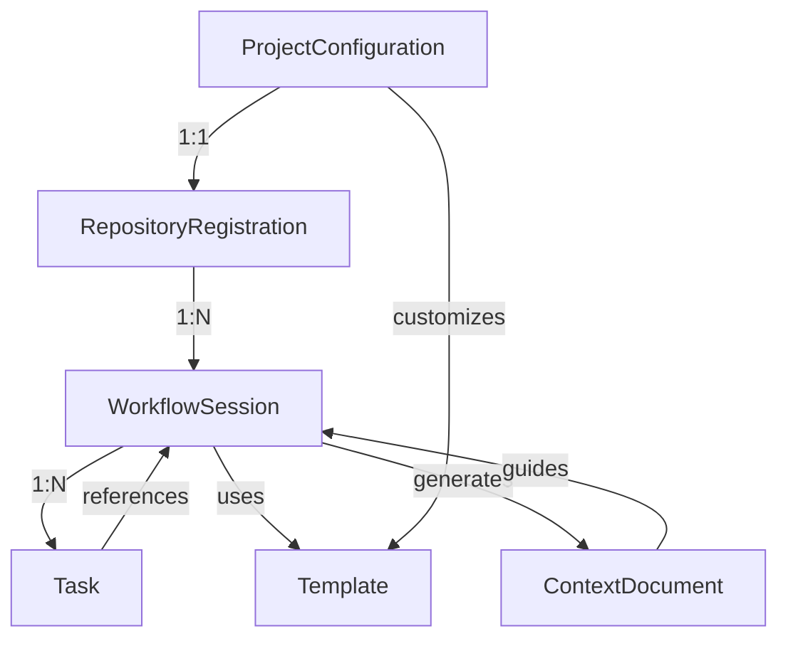

# Data Model: MCP Server for Centralized Spec-Kit Functionality

**Date**: 2025-09-19
**Feature**: MCP Server for Centralized Spec-Kit Functionality

## Core Entities

### 1. ProjectConfiguration

Represents project-specific settings and customizations.

```python
class ProjectConfiguration:
    """Project-specific configuration from .specify-mcp/constitution.yaml"""

    # Identity
    project_id: str           # Unique identifier derived from repo path
    project_name: str         # Human-readable project name
    repository_path: str      # Absolute path to repository

    # Configuration
    version: str              # Configuration schema version
    templates: Dict[str, str] # Custom template overrides
    workflows: List[str]      # Enabled workflow types

    # Settings
    auto_generate_config: bool    # Auto-create constitution.yaml
    preserve_existing: bool       # Coexist with manual spec-kit

    # Validation Rules
    # - repository_path must be valid git repository
    # - version must match semantic versioning
    # - workflows must be subset of ['specify', 'plan', 'tasks']
```

### 2. WorkflowSession

Represents an active specify/plan/tasks execution.

```python
class WorkflowSession:
    """Active workflow execution context"""

    # Identity
    session_id: str           # UUID for session tracking
    workflow_type: str        # 'specify' | 'plan' | 'tasks'
    repository_path: str      # Target repository
    branch_name: str          # Feature branch (e.g., '001-feature')

    # State
    status: str               # 'initializing' | 'running' | 'completed' | 'failed'
    current_phase: str        # Current execution phase
    started_at: datetime      # Session start time
    completed_at: Optional[datetime]  # Session end time

    # Context
    feature_description: str  # User-provided description
    generated_artifacts: List[str]  # Created file paths

    # State Transitions
    # initializing -> running -> completed
    # any -> failed (on error)
```

### 3. Template

Represents reusable document templates.

```python
class Template:
    """Reusable template for specifications, plans, and tasks"""

    # Identity
    template_id: str          # Unique identifier (e.g., 'spec-v1')
    template_type: str        # 'spec' | 'plan' | 'tasks' | 'research'
    version: str              # Template version

    # Content
    content: str              # Template markdown content
    variables: List[str]      # Required template variables
    sections: List[str]       # Template section names

    # Metadata
    is_embedded: bool         # True if bundled with server
    source_path: Optional[str]  # Path if custom template

    # Validation Rules
    # - content must be valid markdown
    # - variables must follow {{variable}} pattern
    # - template_type must be valid workflow type
```

### 4. Task

Structured work item replacing markdown task lists.

```python
class Task:
    """Structured task representation"""

    # Identity
    task_id: str              # Unique task identifier
    order: int                # Execution order (1-based)

    # Content
    description: str          # Task description
    category: str             # 'test' | 'implement' | 'document' | 'validate'

    # Dependencies
    depends_on: List[str]     # Task IDs that must complete first
    parallel_group: Optional[str]  # Group ID for parallel execution

    # Status
    status: str               # 'pending' | 'in_progress' | 'completed' | 'blocked'
    assigned_to: Optional[str]  # Optional assignee

    # Metadata
    created_at: datetime      # Task creation time
    updated_at: datetime      # Last modification time
    specification_ref: str    # Reference to source spec

    # State Transitions
    # pending -> in_progress -> completed
    # in_progress -> blocked -> in_progress
```

### 5. ContextDocument

Phase-specific documentation served to users.

```python
class ContextDocument:
    """Context document for current development phase"""

    # Identity
    document_id: str          # Unique identifier
    document_type: str        # 'constitution' | 'quickstart' | 'api' | 'guide'

    # Relevance
    phase: str                # 'research' | 'design' | 'implement' | 'validate'
    workflow: str             # Associated workflow type

    # Content
    content: str              # Document content (markdown)
    metadata: Dict[str, Any]  # Additional document metadata

    # Access
    visibility: str           # 'always' | 'phase-specific' | 'on-demand'
    priority: int             # Display priority (lower = higher priority)

    # Validation Rules
    # - phase must be valid development phase
    # - visibility determines when document is served
```

### 6. RepositoryRegistration

Connection between git repository and MCP server.

```python
class RepositoryRegistration:
    """Repository registration with MCP server"""

    # Identity
    repository_id: str        # Unique repository identifier
    repository_path: str      # Absolute path to repository
    remote_url: Optional[str]  # Git remote URL

    # Configuration
    config_path: str          # Path to .specify-mcp/constitution.yaml
    active_branch: str        # Current working branch

    # State
    is_initialized: bool      # Has .specify-mcp directory
    has_legacy_speckit: bool  # Contains templates/ or scripts/
    last_accessed: datetime   # Last workflow execution

    # Permissions
    read_only: bool           # If true, no modifications allowed

    # Validation Rules
    # - repository_path must contain .git directory
    # - config_path must be within repository
```

## Relationships



## Data Persistence

### File System Structure

```
~/.specify-mcp/
├── logs/
│   └── server.log           # Server operation logs
├── sessions/
│   └── {session_id}.yaml    # Active session data
└── cache/
    └── templates/           # Cached template content

{repository}/.specify-mcp/
├── constitution.yaml        # Project configuration
├── config.yaml              # Additional settings
└── tasks/
    └── {branch}.yaml        # Task definitions per branch
```

### YAML Schema Examples

**constitution.yaml**:

```yaml
version: "1.0.0"
project_name: "my-project"
workflows:
  - specify
  - plan
  - tasks
templates:
  spec: "custom-spec-template.md"
settings:
  auto_generate_config: true
  preserve_existing: true
```

**tasks.yaml**:

```yaml
tasks:
  - id: "task-001"
    order: 1
    description: "Write contract tests for MCP tools"
    category: "test"
    status: "pending"
    depends_on: []
    parallel_group: "tests"

  - id: "task-002"
    order: 2
    description: "Implement specify MCP tool"
    category: "implement"
    status: "pending"
    depends_on: ["task-001"]
```

## Validation Rules

1. **Referential Integrity**
   - All task dependencies must reference existing tasks
   - Template references must resolve to available templates
   - Session must reference valid repository registration

2. **State Consistency**
   - Only one workflow session active per repository
   - Task status transitions follow defined state machine
   - Completed sessions cannot be modified

3. **Data Constraints**
   - Repository paths must be absolute and valid
   - Branch names follow git naming conventions
   - Task IDs unique within session

4. **Business Rules**
   - Auto-generate constitution.yaml on first access if missing
   - Preserve existing spec-kit files when detected
   - Templates cascade: project -> server -> embedded

## Performance Considerations

- **Lazy Loading**: Load templates and contexts only when needed
- **Caching**: Cache parsed YAML configurations with file watching
- **Indexing**: Maintain task order index for efficient queries
- **Batching**: Group related file operations to reduce I/O

## Security Considerations

- **Path Validation**: Validate all file paths against repository root
- **Input Sanitization**: Sanitize user inputs before git operations
- **Access Control**: Respect read_only flag on repositories
- **Audit Logging**: Log all state-changing operations
